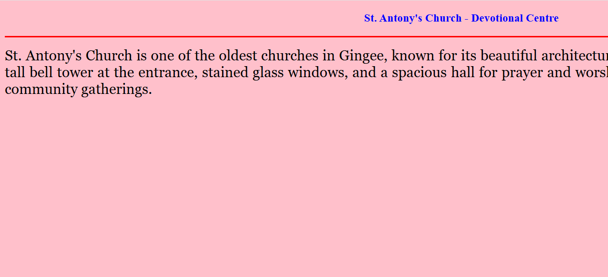

# Ex04 Places Around Me
## Date: 24.9.25

## AIM
To develop a website to display details about the places around my house.

## DESIGN STEPS

### STEP 1
Create a Django admin interface.

### STEP 2
Download your city map from Google.

### STEP 3
Using ```<map>``` tag name the map.

### STEP 4
Create clickable regions in the image using ```<area>``` tag.

### STEP 5
Write HTML programs for all the regions identified.

### STEP 6
Execute the programs and publish them.

## CODE
~~~

map.html
<!DOCTYPE html>
<html lang="en">
<head>
  
  <title>Places Around My House</title>
  <style>
    body {
      font-family: Arial, sans-serif;
      background-color: #f2f2f2;
      margin: 0;
      padding: 0;
    }
    header {
      background-color: #0077cc;
      color: white;
      padding: 20px;
      text-align: center;
    }
    .container {
      padding: 20px;
    }
    .place {
      background-color: white;
      border-radius: 8px;
      padding: 15px;
      margin-bottom: 20px;
      box-shadow: 0 2px 5px rgba(0,0,0,0.1);
    }
    .place h2 {
      margin-top: 0;
      color: #0077cc;
    }
    .place p {
      margin: 5px 0;
    }
    footer {
      text-align: center;
      padding: 10px;
      background-color: #ddd;
      font-size: 0.9em;
    }
  </style>
</head>
<body>

  <header>
    <h1>Places Around My House</h1>
  </header>
  <center>
  
  <map name="image-map">
  <area target="_blank" alt="hotel" title="hotel" href="hotel.html" coords="1182,574,1401,493" shape="rect">
  <area target="_blank" alt="church" title="church" href="church.html" coords="834,25,1097,124" shape="rect">
  <area target="_blank" alt="lake" title="lake" href="lake.html" coords="70,514,277,615" shape="rect">
  <area target="_blank" alt="toy" title="toy" href="shop.html" coords="1035,474,1190,400" shape="rect">
  <area target="_blank" alt="grt" title="grt" href="grt..html" coords="614,74,863,178" shape="rect">
</map>
  </map>

  </center>

</body>
</html>

church.html
<!DOCTYPE html>
<html>
<head>
  <title>My Home Town</title>
</head>
<body bgcolor="pink">

  <h3 align="center">
    <font color="blue"><b>St. Antony's Church - Devotional Centre</b></font>
  </h3>
  <hr size="3" color="red">

  <p align="justify">
    <font face="Georgia" size="5">
      St. Antony's Church is one of the oldest churches in Gingee, known for its
      beautiful architecture and serene atmosphere. The church features a tall
      bell tower at the entrance, stained glass windows, and a spacious hall
      for prayer and worship. Visitors come here for peace, reflection, and
      community gatherings.
    </font>
  </p>
</body>
</html>
grt.html
<!DOCTYPE html>
<html>
<head>
    <title>Jewellery Shop</title>
</head>
<body bgcolor="lightyellow">
    <h1 align="center">
        <font color="gold"><b>GRT Jewellery</b></font>
    </h1>
    <h3 align="center">
        <font color="blue"><b>Fine Craftsmanship & Heritage</b></font>
    </h3>
    <hr size="3" color="red">
    <p align="justify">
        <font face="Georgia" size="5">
            Our jewellery showcases timeless designs inspired by tradition. 
            Each piece is intricately handcrafted with precious stones, gold, and silver, 
            reflecting cultural heritage and modern elegance. 
            The collection includes necklaces, bangles, earrings, and rings suitable for 
            special occasions and daily wear.
        </font>
    </p>
</body>
</html>
hotel.html
<!DOCTYPE html>
<html lang="en">
<head>
  <title>My Home Town</title>
  <style>
    body {
      background-color: pink;
      font-family: Georgia, serif;
      line-height: 1.6;
      margin: 0;
      padding: 20px;
    }

    h3 {
      text-align: center;
      margin: 0.5em 0;
    }

    h3 {
      color: blue;
      font-weight: bold;
    }

    hr {
      border: none;
      border-top: 3px solid red;
      width: 50%;
      margin: 20px auto;
    }

    p {
      text-align: justify;
      font-size: 1.1rem;
      max-width: 800px;
      margin: 0 auto;
    }
  </style>
</head>
<body>
  <h3>Pascah Restaurant - Luxury Stay</h3>
  <hr>
  <p>
    Royal Heritage Hotel is a premium hotel located in the heart of Gingee. It offers 
    spacious, elegantly designed rooms with modern amenities, free Wi-Fi, and 
    round-the-clock room service. Guests can enjoy a multi-cuisine restaurant, 
    conference facilities, and a rooftop garden with stunning views of the town. 
    Its central location makes it an ideal choice for both leisure and business travelers.
  </p>
</body>
</html>

lake.html
<!DOCTYPE html>
<html>
<head>
    <title>Beautiful Lake</title>
</head>
<body bgcolor="lightblue">
    <h1 align="center">
        <font color="navy"><b>Vilinjiyambakam Lake</b></font>
    </h1>
    <h3 align="center">
        <font color="green"><b>Nature's Peaceful Retreat</b></font>
    </h3>
    <hr size="3" color="blue">
    <p align="justify">
        <font face="Georgia" size="5">
            The lake is surrounded by lush greenery and gentle hills. 
            Visitors can enjoy boating, fishing, and walking along the scenic pathways. 
            During sunrise and sunset, the reflection of the sky on the water 
            creates a breathtaking view that soothes the mind and soul.
        </font>
    </p>
</body>
</html>
shop.html
<!DOCTYPE html>
<html>
<head>
    <title>Shopping Centre</title>
</head>
<body bgcolor="lightgreen">
    <h1 align="center">
        <font color="darkgreen"><b>Toy Trendz</b></font>
    </h1>
    <h3 align="center">
        <font color="brown"><b>A Place for Every Need</b></font>
    </h3>
    <hr size="3" color="darkgreen">
    <p align="justify">
        <font face="Georgia" size="5">
            The shopping centre offers a wide range of items including 
            groceries, clothing, handicrafts, and electronics. 
            Small local vendors as well as modern stores provide a unique 
            shopping experience that combines tradition with convenience. 
            It is a popular spot for both residents and visitors.
        </font>
    </p>
</body>
</html>
~~~
## OUTPUT





## RESULT
The program for implementing image maps using HTML is executed successfully.
